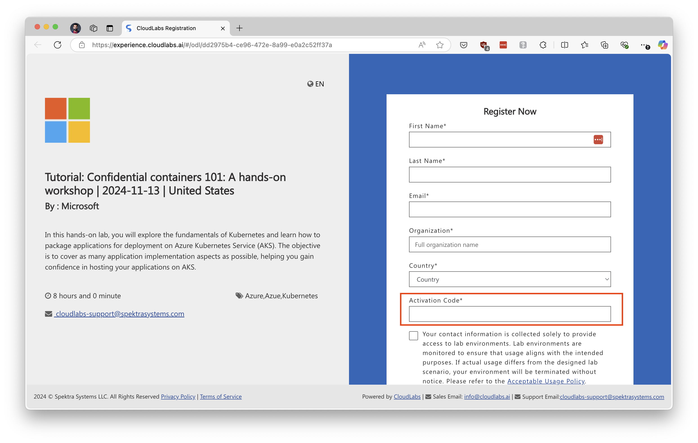
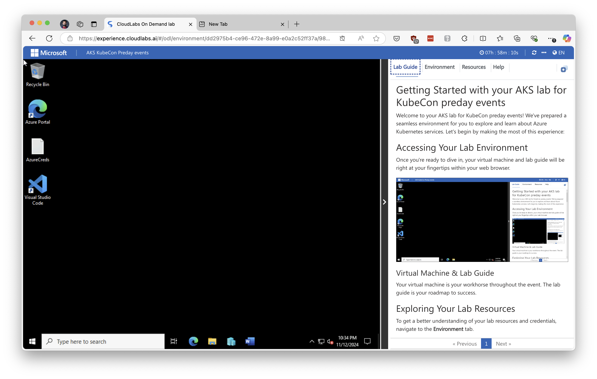
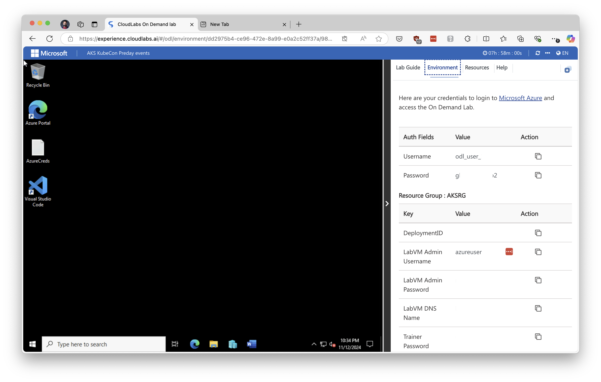

# Preparation For The Workshop

This workshop assumes that you have no prior knowledge of the [Confidential Containers](https://confidentialcontainers.org/), but assumes that you know about Kubernetes and have some experience with it.

For the workshop we will provide you access to the Cloud environment where you will be able to deploy a Kubernetes cluster, deploy the Confidential Containers infrastructure and run the demos.

> [!NOTE]
> The workshop assumes you are running a bash like terminal in Linux, MacOS or Windows WSL.

## Local Setup: Prerequisites

To follow the workshop demos you will need few tools installed on your computer. The workshop can be followed in one of the two ways, either you install all the needed tools on your computer or you use the docker image that we have prepared for you.

### Option 1: Use the Docker image

To use the docker image you will need to have Docker installed on your computer. You can download Docker from [here](https://docs.docker.com/engine/install/).

Once you have Docker installed, clone this repository and run the following command to set up the environment:

```bash
make docker-run
```

### Option 2: Install the tools on your computer

Check which tools are needed for the workshop, by running the following script from the root of this repository:

```bash
./debug/check-prereqs.sh
```

Above script will check if the tools are installed and are in the PATH. If a certain tool is not installed it will error out with helpful information. Install the missing tools and re-run the script until all the tools are installed. If this script runs without errors then you are good to go.

## Cloud Environment: Prerequisites

To get access to the cloud environment, follow the steps below:

- Sign up using the following link: [https://bit.ly/3UC83VU](https://bit.ly/3UC83VU).
- Enter the following activation code: `ACTIVATE45637` when signing up.



- Once inside press the "Launch Lab" button.
- You will see a Windows VM and a "Lab Guide" on the right hand side in a vertical pane.



- Switch to the "Environment" tab and you will see `Username` and `Password`. We will use those for Azure CLI login.



- Login to the Azure Portal by going to [https://portal.azure.com](https://portal.azure.com) and use the `Username` and `Password` from the environment tab.

## Starting Workshop

Once you have a cloud environment ready and your local setup is also done, finish all the steps until the [Infrastructure Deployment](./demo.md#infrastructure-deployment) while the workshop presentation is going on.
